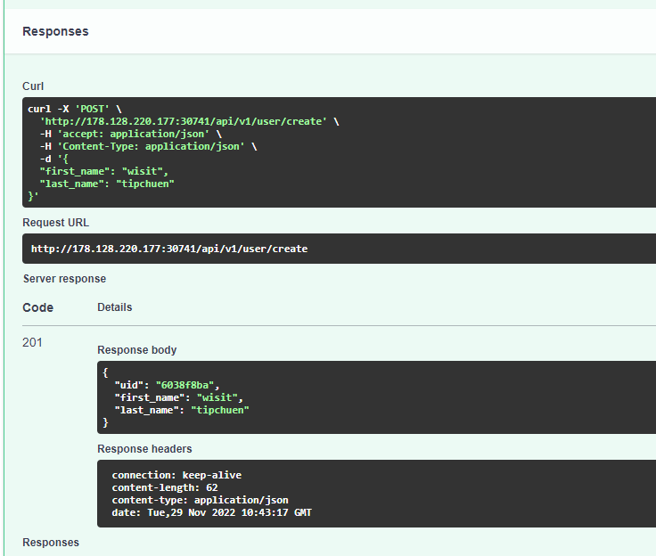
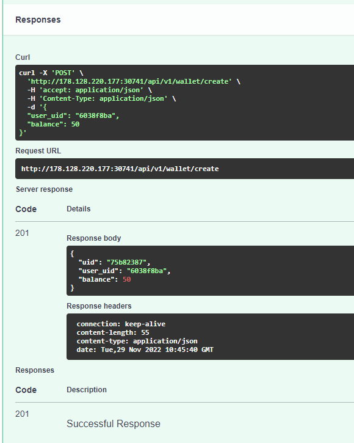

# k8s-bpi

## Diagram


## Prerequisite

- CoreDNS

- Calico CNI

- Default StorageClass

- Metrics Server

- Cert manager

- Helm


## Installation Steps

*ในกระบวนการติดตั้งทั้งหมดนี้ถูกติดตั้งอยู่บน Microk8s*

### For Microk8s

```bash
microk8s enable dns hostpath-storage metrics-server helm cert-manager
```

### Install metrics-server (Optional)

```bash
kubectl apply -f https://github.com/kubernetes-sigs/metrics-server/releases/latest/download/components.yaml
```


### Install ingress

ติดตั้ง Nginx ingress สำหรับใช้เป็น Ingress service พร้อม enable metrics สำหรับให้ prometheus มาดึงข้อมูล

```bash
helm upgrade --install ingress-nginx ingress-nginx \
--repo https://kubernetes.github.io/ingress-nginx \
--namespace ingress-nginx --create-namespace \
--set controller.metrics.enabled=true \
--set-string controller.podAnnotations."prometheus\.io/scrape"="true" \
--set-string controller.podAnnotations."prometheus\.io/port"="10254"
```


#### Get access port

สามารถเข้าถึง service ด้วย `<IP>:<Port>` โดย port สามารถหาได้จากคำสั่งด้านล่าง

```bash
kubectl get svc -n ingress-nginx ingress-nginx-controller -o jsonpath="{.spec.ports[?(@.port==80)].nodePort}"
```


### Install Prometheus stack

ติดตั้ง Prometheus พร้อม Grafana ด้วย helm chart lสำหรับใช้ในการแสดง Dashboard

#### Add helm repo

```bash
helm repo add prometheus-community https://prometheus-community.github.io/helm-charts
helm repo update
```

#### Install with Helm

```bash
cd k8s-bpi/manifests/prometheus
helm upgrade --install monitor --namespace monitor --create-namespace -f prom-custom-values.yaml prometheus-community/kube-prometheus-stack
```


### Install grafana Loki

ติดตั้ง Grafana loki สำหรับจัดเก็บ Log ที่เกิดขึ้นใน cluster

```bash
helm repo add bitnami https://charts.bitnami.com/bitnami
helm install loki -n monitor bitnami/grafana-loki
```


#### Access grafana web ui

เข้าใช้งาน Grafana ด้วย `<IP>:<Port>` โดย port สามารถหาได้จากคำสั่งด้านล่าง

```bash
kubectl get svc -n monitor monitor-grafana -o jsonpath="{.spec.ports[?(@.port==80)].nodePort}"
```

เข้าใช้ในงาน Grafana dashboard ด้วย `username: admin` และ password ด้านล่าง

```bash
kubectl get secrets -n monitor monitor-grafana -o jsonpath='{.data.admin-password}' | base64 -d
```


#### Add data source

เพิ่ม Data source ด้วยเมนู Configuration -> datasources -> add data source หรือเข้าผ่าน url `<ip>:<port>/datasources/new`

- เลือก Datasource เป็น Loki


- ใส่ URL เป็น `http://loki-grafana-loki-gateway.monitor.svc.cluster.local` หลังจากนั้นกด Save and Test

  

- ทดสอบดู Log ในหน้า Explore

  


#### เพิ่ม Dashboard สำหรับ Nginx ingress

- ไปที่ Dashboard -> Import

  

  

- Import Json ด้วยไฟล์ `https://raw.githubusercontent.com/kubernetes/ingress-nginx/main/deploy/grafana/dashboards/nginx.json`

  

  

- เลือก Datasource เป็น prometheus แล้ว Import

  

  

- ตัวอย่างหน้า Dashboard

  

  

- ตัวอย่าง Metric ของ workload


### Install Postgres

ติดตั้ง Postgres พร้อมกำหนด Policy

```bash
cd k8s-bpi
kubectl apply -f manifest/postgres/
```

#### Postgres policy

กำหนด Network policy สำหรับ Pod ที่จะสามารถมีสิทธิ์เข้าถึง Service ของ Postgres ได้ โดยในที่นี้จะกำหนดให้เข้าถึงได้เฉพาะ pod ที่มี Label เป็น `type=backend`เท่านั้น

```yml
# manifests/postgres/policy.yaml
apiVersion: networking.k8s.io/v1
kind: NetworkPolicy
metadata:
  name: postgres-policy
spec:
  podSelector:
    matchLabels:
      app: postgres
  policyTypes:
    - Ingress
  ingress:
    - from:
        - podSelector:
            matchLabels:
              type: backend
      ports:
        - protocol: TCP
          port: 5432
```


### Install Application service

ติดตั้ง User app และ wallet app ด้วยคำสั่ง

```bash
cd k8s-bpi/manifests
kubectl apply -f user/
kubectl apply -f wallet/
```


####  ทดสอบเข้าใช้งาน

##### User app

- ทดลองเข้าใช้งาน user ด้วย url `<ip>:<nginx-ingress-port>/api/v1/user/docs`


- ทดลองสร้าง user

  


##### Wallet app

- ทดลองเข้าใช้งาน user ด้วย url `<ip>:<nginx-ingress-port>/api/v1/wallet/docs`


- ทดลองสร้าง wallet

  


### Application Structure

สำหรับ App ทั้ง 2 ตัวจะมีส่วนประกอบเหมือน ๆ กัน ดังนั้นจะขออธิบายเพียงแอพเดียวเท่านั้น

#### Kubernetes deployment file

```
user/
├── configmap.yml #Config file
├── deployment.yml #Deployment template
├── hpa.yaml #HolizonPotAutoscale policy
├── ingress.yml #Ingress proxy
└── service.yml #service 
```


##### configmap.yaml

ไฟล์นี้มีไว้เพื่อกำหนด environment variable สำหรับเข้าถึง database

*เพื่อความสะดวกในการพัฒนาจีงกำหนด Env เป็นประเภท ConfigMap ซึ่งในความจริงแล้วสำหรับ user/password สมควรเก็บเป็น Secret*

```yaml
apiVersion: v1
kind: ConfigMap
metadata:
  name: user-app-config
  labels:
    app: user-app
data:
  POSTGRES_HOST: postgres.default.svc.cluster.local
  POSTGRES_PORT: "5432"
  POSTGRES_DB: postgresdb
  POSTGRES_USER: admin
  POSTGRES_PASSWORD: psltest
```


##### deployment.yaml

```yaml
apiVersion: apps/v1
kind: Deployment
metadata:
  labels:
    app: user-app
  name: user-app
spec:
  replicas: 1
  selector:
    matchLabels:
      app: user-app
  strategy: {}
  template:
    metadata:
      annotations:
        prometheus.io/port: "8000"
        prometheus.io/scrape: "true"
      labels:
        app: user-app
        type: backend #user for postgres network policy
    spec:
      containers:
      - image: mastertos/bpi-user:latest
        name: user-api
        args:
          - "uvicorn"
          - "user:app"
          - "--proxy-headers"
          - "--root-path"
          - "/api/v1/user" #กำหนด root-path เพื่อใช้งานร่วมกับ ingress proxy
          - "--host"
          - "0.0.0.0"
        ports:
          - containerPort: 8000
        envFrom:
            - configMapRef:
                name: user-app-config #เรียกใช้ env จาก configmap
        imagePullPolicy: Always
        resources: 
          requests:
            cpu: 50m
          limits: #กำหนด cpu และ ram สูงสุดที่สามารถใช้งานได้
            cpu: 200m
            memory: 100M
        livenessProbe:
          httpGet:
            path: /healthz/livez #ทำ endpoint สำหรับเช็ค liveness โดยจะ live เมื่อสามารถใช้งาน fastapi ได้
            port: 8000
          initialDelaySeconds: 3
          periodSeconds: 3
        readinessProbe:
          httpGet:
            path: /healthz/readyz #ทำ endpoint สำหรับเช็ค liveness โดยจะ live เมื่อสามารถเชื่อมต่อกับ database ได้
            port: 8000
          initialDelaySeconds: 3
          periodSeconds: 3
status: {}

```


##### hpa.yaml

```yaml
apiVersion: autoscaling/v1
kind: HorizontalPodAutoscaler
metadata:
  name: user-app-hpa
spec:
  scaleTargetRef:
    apiVersion: apps/v1
    kind: Deployment
    name: user-app
  minReplicas: 1
  maxReplicas: 10 #สามารถ scale ได้สูงสุด 10 pods
  targetCPUUtilizationPercentage: 50 #เงื่อนไขคือใช้ cpu มากกว่า  50% หรือ 100m ถ้าเทียบกับ deployment.yaml
```


##### ingress.yaml

```yaml
apiVersion: networking.k8s.io/v1
kind: Ingress
metadata:
  name: user-ingress
  annotations:
    nginx.ingress.kubernetes.io/rewrite-target: /$2 #rewrite uri path ที่เข้ามเช่น /api/v1/user/create จะเป็น /create
spec:
  ingressClassName: nginx
  rules:
  - http:
      paths:
      - backend:
          service:
            name: user-svc
            port:
              number: 80
        path: /api/v1/user(/|$)(.*) #url ที่ขึ้นต้ยด้วย /api/v1/user/
        pathType: Prefix
status:
  loadBalancer: {}

```


##### service.yaml

```yaml
apiVersion: v1
kind: Service
metadata:
  name: user-svc
spec:
  selector:
    app: user-app
  ports:
    - protocol: "TCP"
      port: 80
      targetPort: 8000
  type: ClusterIP
```

